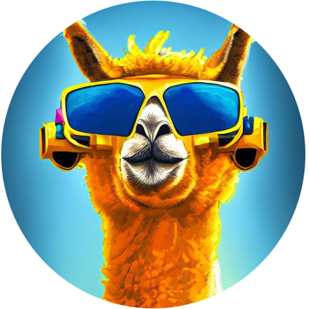

# alpaca-lora-sv
A swedish finetuned instruction LLaMA

This repository contains code training a swedish Alpaca model and striving to reproduce the [Stanford Alpaca](https://github.com/tatsu-lab/stanford_alpaca) results using [low-rank adaptation (LoRA)](https://arxiv.org/pdf/2106.09685.pdf).

We translated the [alpaca_data_cleaned.json](https://github.com/tatsu-lab/stanford_alpaca/blob/main/alpaca_data_cleaned.json) to swedish using ChatGPT. 

## Troubleshooting

#### undefined symbol: cget_col_row_stats / 8-bit not working / libsbitsandbytes_cpu.so not found

cp libbitsandbytes_cuda117.so libbitsandbytes_cpu.so

